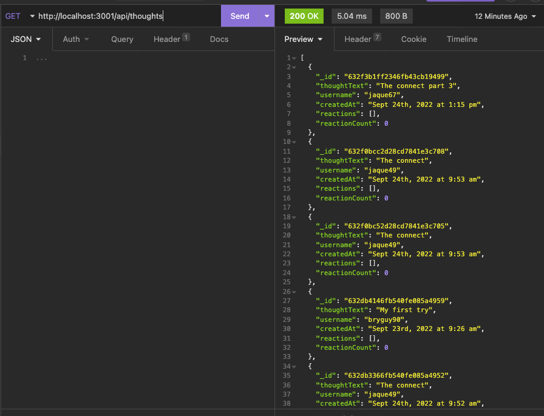
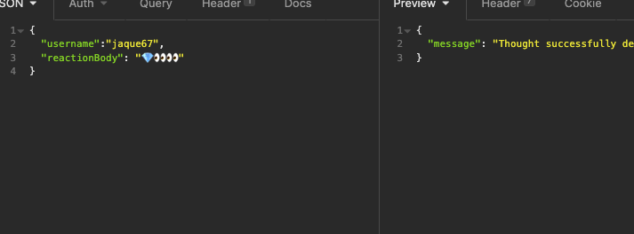
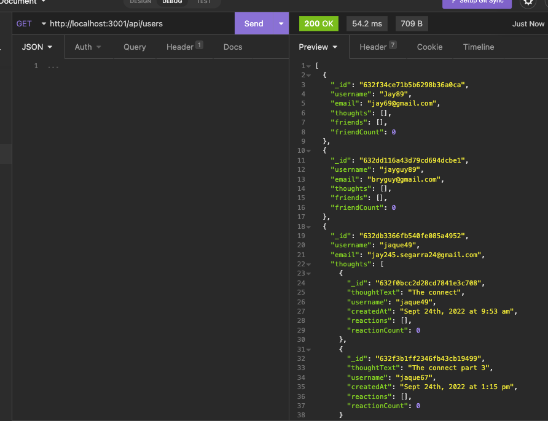
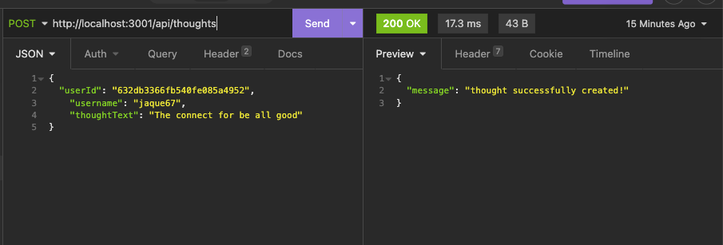
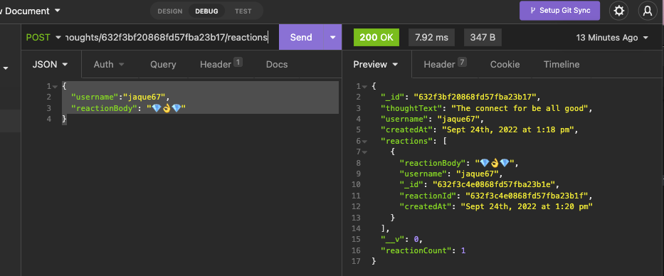
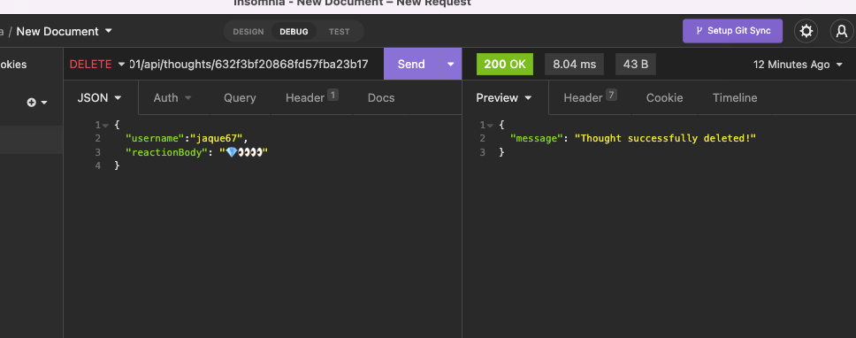

# NoSql-SocialNetwork-API

  ## Table-of-Contents
  * [Description](#description)
  * [Installation](#installation)
  
  
    *[License](#license)
    
  * [Contributing](#contributing)
  * [Tests](#tests)
  * [Questions](#questions)
  
  ## Description
  In this project i can make a Social-Network and add users with their thoughts and also add fun reactions to the message  and also show the date it was made for. At the moment this is for back-end. This is possible with mongoose and the mongoDB and also the use of express this is a fun project i had fun to play around with but later on i'll make it possible with front-end and add more function and also a login section but that's later on.

  ## [Installation](#table-of-contents)
  npm i express, npm i mongoose and finally npm i.
   
 

  ## Contributing

   
      Thank you for your interest in helping out; however, I will not be accepting contributions from third parties.
      
  ## [Tests](#table-of-contents)
  i'l show you the steps therough the video below:

 [VIDEO1](https://drive.google.com/file/d/1ht_0XfVDryQrlhwfe6p6zSLjFAMwdkwq/view)
 [VIDEO](https://drive.google.com/file/d/1Xgq6sdePbwIzG20wXiIMsqsXGwAP_FlO/view)

 
 
 
 
 
 

  ##  [Questions](#table-of-contents)
  Please contact me using the following links:
  [GitHub](https://github.com/bryguy20)
  [Email: bryansegarra044@gmail.com](mailto:bryansegarra044@gmail.com)
